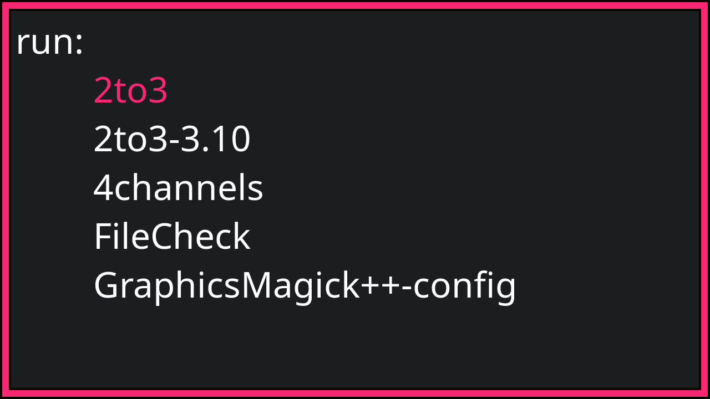
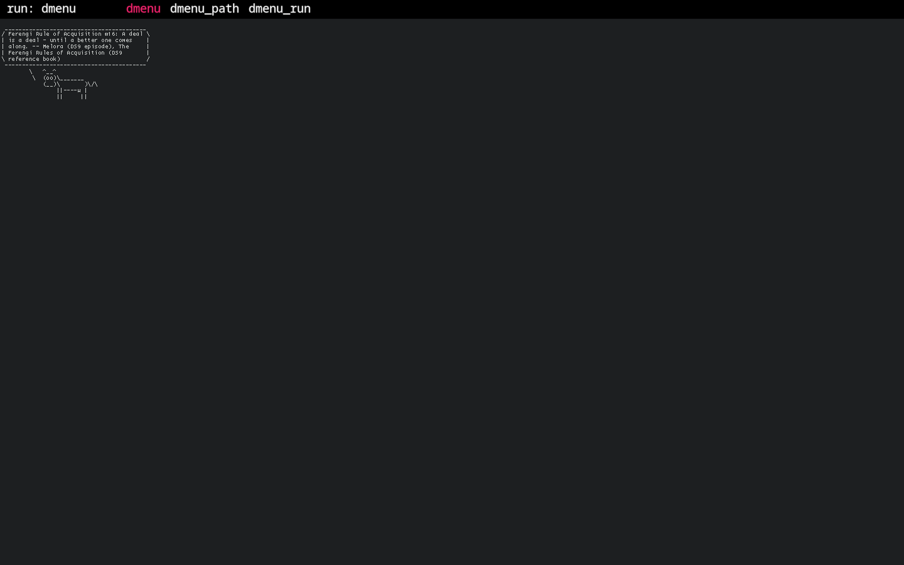
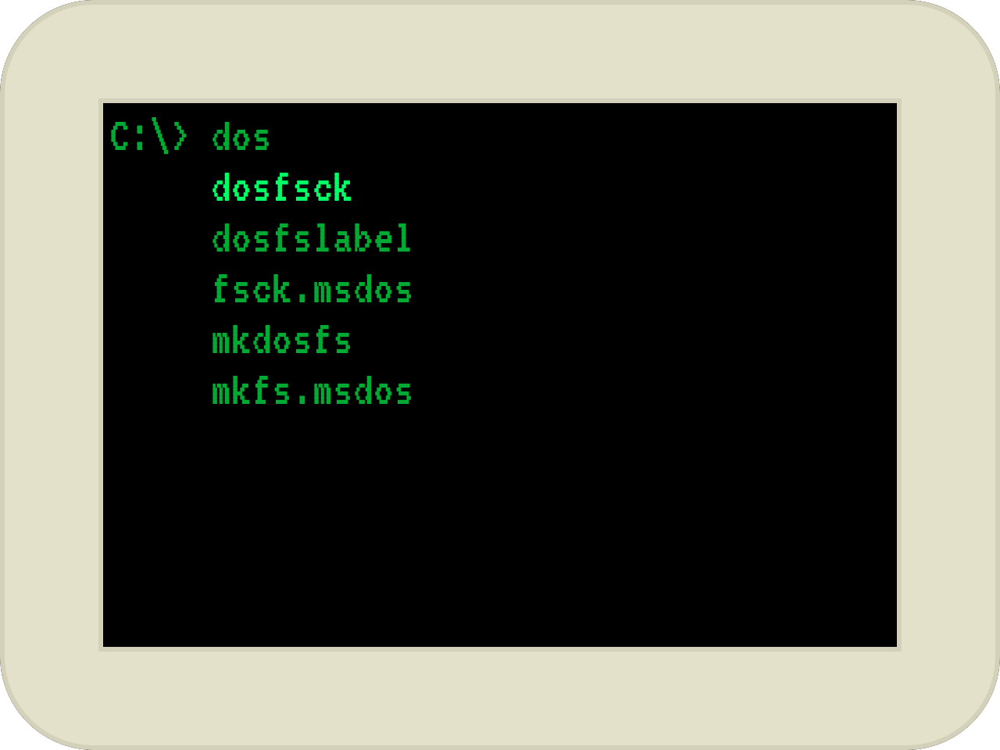

# Tofi

An extremely fast and simple [dmenu](https://tools.suckless.org/dmenu/) /
[rofi](https://github.com/davatorium/rofi) replacement for
[wlroots](https://gitlab.freedesktop.org/wlroots/wlroots)-based
[Wayland](https://wayland.freedesktop.org/) compositors such as
[Sway](https://github.com/swaywm/sway/).

The aim is to do just what I want it to as quick as possible.

When [configured correctly](#performance), tofi can get on screen within a
single frame.


## Table of Contents
* [Install](#install)
  * [Building](#building)
  * [Arch](#arch)
* [Usage](#usage)
  * [Theming](#theming)
* [Performance](#performance)
  * [Options](#options)
  * [Benchmarks](#benchmarks)

## Install
### Building

Install the necessary dependencies, e.g. for Arch:
```sh
# Runtime dependencies
sudo pacman -S freetype2 harfbuzz cairo pango wayland libxkbcommon

# Build-time dependencies
sudo pacman -S meson scdoc wayland-protocols
```

Then build:
```sh
meson build && ninja -C build install
```

### Arch
Tofi is available in the [AUR](https://aur.archlinux.org/packages/tofi-git):
```sh
paru -S tofi
```

## Usage

By default, running `tofi` causes it to act like dmenu, accepting options on
`stdin` and printing the selection to `stdout`.

`tofi-run` is a symlink to `tofi`, which will cause tofi to display a list of
executables under the user's `$PATH`.

`tofi-drun` is also a symlink to `tofi`, which will cause tofi to display a
list of applications found in desktop files as described by the [Desktop Entry
Specification](https://specifications.freedesktop.org/desktop-entry-spec/desktop-entry-spec-latest.html).

**WARNING**: In the latest version of tofi, the default behaviour of drun mode
has changed. Previously, when a selection was made in drun mode, the filename
of the selected desktop file was printed to stdout. This couldn't be passed
directly to swaymsg exec however, so applications launched in drun mode
wouldn't always stay in the correct workspace. In the current version of tofi,
this has changed to an executable command line, to be passed to swaymsg exec or
similar. The drun-print-exec option is therefore useless and deprecated, and
may be removed from a future version of tofi, so you should remove it from your
configs.

To use as a launcher for Sway, add something similar to the following to your
Sway config file:
```
set $menu tofi-run | xargs swaymsg exec --
bindsym $mod+d exec $menu
```

For `tofi-drun`, there are two possible methods:
```
# Launch via Sway
set $drun tofi-drun | xargs swaymsg exec --
bindsym $mod+Shift+d exec $drun

# Launch directly
set $drun tofi-drun --drun-launch=true
bindsym $mod+Shift+d exec $drun
```

See the main [manpage](doc/tofi.1.md) for more info.

### Theming

Tofi supports a fair number of theming options - see the config file
[manpage](doc/tofi.5.md) for a complete description. Theming is based on the
box model shown below:

This consists of a box with a border, border outlines and optionally rounded
corners. Text inside the box can either be laid out vertically:
```
╔═══════════════════╗
║ prompt   input    ║
║          result 1 ║
║          result 2 ║
║          ...      ║
╚═══════════════════╝
```
or horizontally:
```
╔═══════════════════════════════════════════╗
║ prompt   input    result 1  result 2  ... ║
╚═══════════════════════════════════════════╝
```

A few example themes are included and shown below. Note that you may need to
tweak them to look correct on your display.

[`themes/fullscreen`](themes/fullscreen)


[`themes/dmenu`](themes/dmenu)


[`themes/dos`](themes/dos)


## Performance

By default, tofi isn't really any faster than its alternatives. However, when
configured correctly, it can startup and get on screen within a single frame,
or about 2ms in the ideal case.

### Options
In roughly descending order, the most important options for performance are:

* `--font` - This is *by far* the most important option. By default, tofi uses
  [Pango](https://pango.gnome.org/) for font rendering, which (on Linux) looks
  up fonts via
  [Fontconfig](https://www.freedesktop.org/wiki/Software/fontconfig/).
  Unfortunately, this font lookup is about as slow as wading through treacle
  (relatively speaking). On battery power on my laptop (Arch linux, AMD Ryzen 5
  5600U), with ~10000 fonts as the output of `fc-list`, loading a single font
  with Pango & Fontconfig takes ~120ms.

  The solution is to pass a path to a font file to `--font`, e.g. `--font
  /usr/share/fonts/noto/NotoSansMono-Regular.ttf`. Tofi will then skip any font
  searching, and use [Harfbuzz](https://harfbuzz.github.io/) and
  [Cairo](https://www.cairographics.org/) directly to load the font and display
  text. This massively speeds up startup (font loading takes <1ms). The (minor
  for me) downside is that any character not in the specified font won't render
  correctly, but unless you have commands (or items) with CJK characters or
  emojis in their names, that shouldn't be an issue.
  
* `--width`, `--height` - Larger windows take longer to draw (mostly just for
  the first frame). Again, on battery power on my laptop, drawing a fullscreen
  window (2880px × 1800px) takes ~20ms on the first frame, whereas a dmenu-like
  ribbon (2880px × 60px) takes ~1ms.
  
* `--num-results` - By default, tofi auto-detects how many results will fit in
  the window. This is quite tricky when `--horizontal=true` is passed, and
  leads to a few ms slowdown (only in this case). Setting a fixed number of
  results will speed this up, but since this likely only applies to dmenu-like
  themes (which are already very quick) it's probably not worth setting this.

* `--hint-font` - Getting really into it now, one of the remaining slow points
  is hinting fonts. For the dmenu theme on battery power on my laptop, with a
  specific font file chosen, the initial text render with the default font
  hinting takes ~4-6ms. Specifying `--hint-font false` drops this to ~1ms. For
  hidpi screens or large font sizes, this doesn't noticeably impact font
  sharpness, but your mileage may vary. This option has no effect if a path to
  a font file hasn't been passed to `--font`.

* `--late-keyboard-init` - The last avoidable thing that slows down startup is
  initialisation of the keyboard. This only takes 1-2ms on my laptop, but up
  to 60ms on a Raspberry Pi Zero 2 W. Passing this option will delay keyboard
  initialisation until after the first draw to screen, meaning that *keypresses
  will be missed* until then, so it's disabled by default.

### Benchmarks

Below are some rough benchmarks of the included themes on different machines.
The time shown is measured from program launch to Sway reporting that the
window has entered the screen. Results are the mean and standard deviation of
10 runs. All tests were performed with `--font /path/to/font/file.ttf` and
`--hint-font false`.

<table>
  <thead>
    <tr>
      <th colspan=2 rowspan=2/>
      <th colspan=3> Theme </th>
    </tr>
    <tr>
      <th> fullscreen </th>
      <th> dmenu </th>
      <th> dos </th>
    </tr>
  </thead>
  <tbody>
    <tr>
      <th rowspan=4> Machine </th>
      <th> Ryzen 7 3700X <br> 2560px × 1440px </th>
      <td align=right> 9.5ms ± 1.8ms </td>
      <td align=right> 5.2ms ± 1.5ms </td>
      <td align=right> 6.1ms ± 1.3ms </td>    </tr>
    <tr>
      <th> Ryzen 5 5600U (AC) <br> 2880px × 1800px </th>
      <td align=right> 17.1ms ± 1.4ms </td>
      <td align=right> 4.0ms ± 0.5ms </td>
      <td align=right> 6.7ms ± 1.1ms </td>
    </tr>
    <tr>
      <th> Ryzen 5 5600U (battery) <br> 2880px × 1800px </th>
      <td align=right> 28.1ms ± 3.7ms </td>
      <td align=right> 6.0ms ± 1.6ms </td>
      <td align=right> 12.3ms ± 3.4ms </td>
    </tr>
    <tr>
      <th> Raspberry Pi Zero 2 W <br> 1920px × 1080px </th>
      <td align=right> 119.0ms ± 5.9ms </td>
      <td align=right> 67.3ms ± 10.2ms </td>
      <td align=right> 110.0ms ± 10.3ms </td>
    </tr>
  </tbody>
</table>

The table below additionally includes `--late-keyboard-init` in the arguments.

<table>
  <thead>
    <tr>
      <th colspan=2 rowspan=2/>
      <th colspan=3> Theme </th>
    </tr>
    <tr>
      <th> fullscreen </th>
      <th> dmenu </th>
      <th> dos </th>
    </tr>
  </thead>
  <tbody>
    <tr>
      <th rowspan=4> Machine </th>
      <th> Ryzen 7 3700X <br> 2560px × 1440px </th>
      <td align=right> 7.9ms ± 1.0ms </td>
      <td align=right> 2.3ms ± 0.8ms </td>
      <td align=right> 3.8ms ± 0.8ms </td>    </tr>
    <tr>
      <th> Ryzen 5 5600U (AC) <br> 2880px × 1800px </th>
      <td align=right> 13.4ms ± 0.8ms </td>
      <td align=right> 2.6ms ± 0.5ms </td>
      <td align=right> 5.5ms ± 0.51ms </td>
    </tr>
    <tr>
      <th> Ryzen 5 5600U (battery) <br> 2880px × 1800px </th>
      <td align=right> 21.8ms ± 1.8ms </td>
      <td align=right> 3.6ms ± 0.7ms </td>
      <td align=right> 8.1ms ± 0.7ms </td>
    </tr>
    <tr>
      <th> Raspberry Pi Zero 2 W <br> 1920px × 1080px </th>
      <td align=right> 98.3ms ± 5.7ms </td>
      <td align=right> 44.8ms ± 16.3ms </td>
      <td align=right> 87.4ms ± 9.9ms </td>
    </tr>
  </tbody>
</table>
