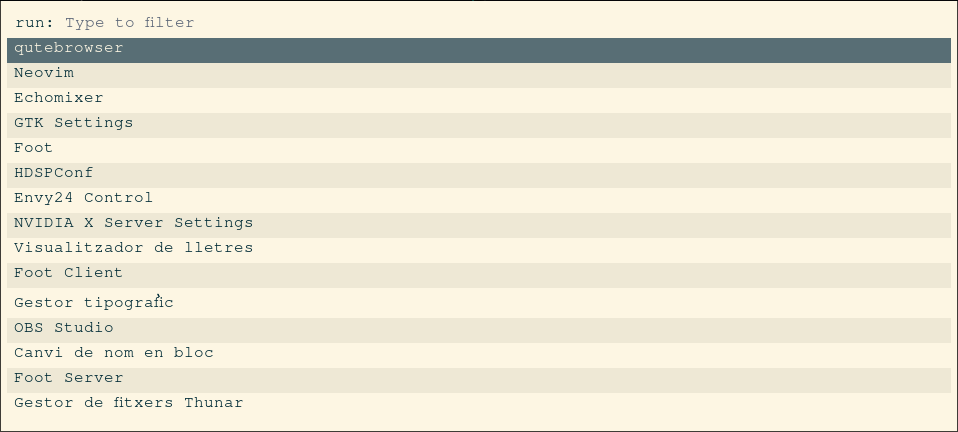

# Tofi

An extremely fast and simple [dmenu](https://tools.suckless.org/dmenu/) /
[rofi](https://github.com/davatorium/rofi) replacement for
[wlroots](https://gitlab.freedesktop.org/wlroots/wlroots)-based
[Wayland](https://wayland.freedesktop.org/) compositors such as
[Sway](https://github.com/swaywm/sway/).

The aim is to do just what I want it to as quick as possible.

When [configured correctly](#performance), tofi can get on screen within a
single frame.


## Table of Contents
* [Install](#install)
  * [Building](#building)
  * [Arch](#arch)
* [Usage](#usage)
  * [Theming](#theming)
* [Performance](#performance)
  * [Options](#options)
  * [Benchmarks](#benchmarks)
  * [Where is the time spent?](#where-is-the-time-spent)

## Install
### Building

Install the necessary dependencies.

#### For Arch:
```sh
# Runtime dependencies
sudo pacman -S freetype2 harfbuzz cairo pango wayland libxkbcommon

# Build-time dependencies
sudo pacman -S meson scdoc wayland-protocols
```

#### For Fedora
```sh
# Runtime dependencies
sudo dnf install freetype-devel cairo-devel pango-devel wayland-devel libxkbcommon-devel harfbuzz

# Build-time dependencies
sudo dnf install meson scdoc wayland-protocols-devel
```

#### For Debian/Ubuntu

```sh
# Runtime dependencies
sudo apt install libfreetype-dev libcairo2-dev libpango1.0-dev libwayland-dev libxkbcommon-dev libharfbuzz-dev

# Build-time dependencies
sudo apt install meson scdoc wayland-protocols
```

Then build:
```sh
meson build && ninja -C build install
```

### Arch
Tofi is available in the [AUR](https://aur.archlinux.org/packages/tofi):
```sh
paru -S tofi
```

## Usage

By default, running `tofi` causes it to act like dmenu, accepting options on
`stdin` and printing the selection to `stdout`.

`tofi-run` is a symlink to `tofi`, which will cause tofi to display a list of
executables under the user's `$PATH`.

`tofi-drun` is also a symlink to `tofi`, which will cause tofi to display a
list of applications found in desktop files as described by the [Desktop Entry
Specification](https://specifications.freedesktop.org/desktop-entry-spec/desktop-entry-spec-latest.html).

To use as a launcher for Sway, add something similar to the following to your
Sway config file:
```
set $menu tofi-run | xargs swaymsg exec --
bindsym $mod+d exec $menu
```

For `tofi-drun`, there are two possible methods:
```
# Launch via Sway
set $drun tofi-drun | xargs swaymsg exec --
bindsym $mod+Shift+d exec $drun

# Launch directly
set $drun tofi-drun --drun-launch=true
bindsym $mod+Shift+d exec $drun
```

See the main [manpage](doc/tofi.1.md) for more info.

### Theming

Tofi supports a fair number of theming options - see the default [config
file](doc/config) or the config file [manpage](doc/tofi.5.md) for a complete
description. Theming is based on the box model shown below:


This consists of a box with a border, border outlines and optionally rounded
corners. Text inside the box can either be laid out vertically:
```
╔═══════════════════╗
║ prompt   input    ║
║          result 1 ║
║          result 2 ║
║          ...      ║
╚═══════════════════╝
```
or horizontally:
```
╔═══════════════════════════════════════════╗
║ prompt   input    result 1  result 2  ... ║
╚═══════════════════════════════════════════╝
```
Each piece of text can have its colour customised, and be surrounded by a box
with optionally rounded corners,

A few example themes are included and shown below. Note that you may need to
tweak them to look correct on your display.

[`themes/fullscreen`](themes/fullscreen)


[`themes/dmenu`](themes/dmenu)


[`themes/dos`](themes/dos)


[`themes/dark-paper`](themes/dark-paper)


[`themes/soy-milk`](themes/soy-milk)


[`themes/rofi`](themes/rofi)


## Performance

By default, tofi isn't really any faster than its alternatives. However, when
configured correctly, it can startup and get on screen within a single frame,
or about 2ms in the ideal case.

### Options
In roughly descending order, the most important options for performance are:

* `--font` - This is *by far* the most important option. By default, tofi uses
  [Pango](https://pango.gnome.org/) for font rendering, which (on Linux) looks
  up fonts via
  [Fontconfig](https://www.freedesktop.org/wiki/Software/fontconfig/).
  Unfortunately, this font lookup is about as slow as wading through treacle
  (relatively speaking). On battery power on my laptop (Arch linux, AMD Ryzen 5
  5600U), with ~10000 fonts as the output of `fc-list`, loading a single font
  with Pango & Fontconfig takes ~120ms.

  The solution is to pass a path to a font file to `--font`, e.g. `--font
  /usr/share/fonts/noto/NotoSansMono-Regular.ttf`. Tofi will then skip any font
  searching, and use [Harfbuzz](https://harfbuzz.github.io/) and
  [Cairo](https://www.cairographics.org/) directly to load the font and display
  text. This massively speeds up startup (font loading takes <1ms). The (minor
  for me) downside is that any character not in the specified font won't render
  correctly, but unless you have commands (or items) with CJK characters or
  emojis in their names, that shouldn't be an issue.
  
* `--width`, `--height` - Larger windows take longer to draw (mostly just for
  the first frame). Again, on battery power on my laptop, drawing a fullscreen
  window (2880px × 1800px) takes ~20ms on the first frame, whereas a dmenu-like
  ribbon (2880px × 60px) takes ~1ms.
  
* `--num-results` - By default, tofi auto-detects how many results will fit in
  the window. This is quite tricky when `--horizontal=true` is passed, and
  leads to a few ms slowdown (only in this case). Setting a fixed number of
  results will speed this up, but since this likely only applies to dmenu-like
  themes (which are already very quick) it's probably not worth setting this.

* `--*-background` - Drawing background boxes around text effectively requires
  drawing the text twice, so specifying a lot of these options can lead to a
  couple of ms slowdown.

* `--hint-font` - Getting really into it now, one of the remaining slow points
  is hinting fonts. For the dmenu theme on battery power on my laptop, with a
  specific font file chosen, the initial text render with the default font
  hinting takes ~4-6ms. Specifying `--hint-font false` drops this to ~1ms. For
  hidpi screens or large font sizes, this doesn't noticeably impact font
  sharpness, but your mileage may vary. This option has no effect if a path to
  a font file hasn't been passed to `--font`.

* `--ascii-input` - Proper Unicode handling is slower than plain ASCII - on the
  order of a few ms for ~40 kB of input. Specifying `--ascii-input true` will
  disable some of this handling, speeding up tofi's startup, but searching for
  non-ASCII characters may not work properly.

* `--late-keyboard-init` - The last avoidable thing that slows down startup is
  initialisation of the keyboard. This only takes 1-2ms on my laptop, but up
  to 60ms on a Raspberry Pi Zero 2 W. Passing this option will delay keyboard
  initialisation until after the first draw to screen, meaning that *keypresses
  will be missed* until then, so it's disabled by default.

### Benchmarks

Below are some rough benchmarks of the included themes on different machines.
These were generated with version 0.1.0 of tofi. The time shown is measured
from program launch to Sway reporting that the window has entered the screen.
Results are the mean and standard deviation of 10 runs. All tests were
performed with `--font /path/to/font/file.ttf`, `--hint-font false` and the
equivalent of `--ascii-input true` (as tofi 0.1.0 didn't support Unicode text).

<table>
  <thead>
    <tr>
      <th colspan=2 rowspan=2/>
      <th colspan=3> Theme </th>
    </tr>
    <tr>
      <th> fullscreen </th>
      <th> dmenu </th>
      <th> dos </th>
    </tr>
  </thead>
  <tbody>
    <tr>
      <th rowspan=4> Machine </th>
      <th> Ryzen 7 3700X <br> 2560px × 1440px </th>
      <td align=right> 9.5ms ± 1.8ms </td>
      <td align=right> 5.2ms ± 1.5ms </td>
      <td align=right> 6.1ms ± 1.3ms </td>    </tr>
    <tr>
      <th> Ryzen 5 5600U (AC) <br> 2880px × 1800px </th>
      <td align=right> 17.1ms ± 1.4ms </td>
      <td align=right> 4.0ms ± 0.5ms </td>
      <td align=right> 6.7ms ± 1.1ms </td>
    </tr>
    <tr>
      <th> Ryzen 5 5600U (battery) <br> 2880px × 1800px </th>
      <td align=right> 28.1ms ± 3.7ms </td>
      <td align=right> 6.0ms ± 1.6ms </td>
      <td align=right> 12.3ms ± 3.4ms </td>
    </tr>
    <tr>
      <th> Raspberry Pi Zero 2 W <br> 1920px × 1080px </th>
      <td align=right> 119.0ms ± 5.9ms </td>
      <td align=right> 67.3ms ± 10.2ms </td>
      <td align=right> 110.0ms ± 10.3ms </td>
    </tr>
  </tbody>
</table>

The table below additionally includes `--late-keyboard-init` in the arguments.

<table>
  <thead>
    <tr>
      <th colspan=2 rowspan=2/>
      <th colspan=3> Theme </th>
    </tr>
    <tr>
      <th> fullscreen </th>
      <th> dmenu </th>
      <th> dos </th>
    </tr>
  </thead>
  <tbody>
    <tr>
      <th rowspan=4> Machine </th>
      <th> Ryzen 7 3700X <br> 2560px × 1440px </th>
      <td align=right> 7.9ms ± 1.0ms </td>
      <td align=right> 2.3ms ± 0.8ms </td>
      <td align=right> 3.8ms ± 0.8ms </td>    </tr>
    <tr>
      <th> Ryzen 5 5600U (AC) <br> 2880px × 1800px </th>
      <td align=right> 13.4ms ± 0.8ms </td>
      <td align=right> 2.6ms ± 0.5ms </td>
      <td align=right> 5.5ms ± 0.51ms </td>
    </tr>
    <tr>
      <th> Ryzen 5 5600U (battery) <br> 2880px × 1800px </th>
      <td align=right> 21.8ms ± 1.8ms </td>
      <td align=right> 3.6ms ± 0.7ms </td>
      <td align=right> 8.1ms ± 0.7ms </td>
    </tr>
    <tr>
      <th> Raspberry Pi Zero 2 W <br> 1920px × 1080px </th>
      <td align=right> 98.3ms ± 5.7ms </td>
      <td align=right> 44.8ms ± 16.3ms </td>
      <td align=right> 87.4ms ± 9.9ms </td>
    </tr>
  </tbody>
</table>

#### Bonus Round: Transparent HugePages

It turns out that it's possible to speed up fullscreen windows somewhat with
some advanced memory tweaks. See [this Stack Overflow
question](https://stackoverflow.com/questions/73278608/can-mmaps-performance-be-improved-for-shared-memory)
if you want full details, but basically by setting
`/sys/kernel/mm/transparent_hugepage/shmem_enabled` to `advise`, we can tell
the kernel we're going to be working with large memory areas. This results in
fewer page faults when first allocating memory, speeding up tofi.

Note that I don't recommend you play with this unless you know what you're
doing (I don't), but I've included it just in case, and to show that the
slowdown on large screens is partially due to factors beyond tofi's control.

The table below shows the effects of additionally enabling hugepages from the
table above. The dmenu theme has been skipped, as the window it creates is too
small to benefit from them. The Raspberry Pi is also omitted, as it doesn't
support hugepages.

<table>
  <thead>
    <tr>
      <th colspan=2 rowspan=2/>
      <th colspan=2> Theme </th>
    </tr>
    <tr>
      <th> fullscreen </th>
      <th> dos </th>
    </tr>
  </thead>
  <tbody>
    <tr>
      <th rowspan=3> Machine </th>
      <th> Ryzen 7 3700X <br> 2560px × 1440px </th>
      <td align=right> 6.9ms ± 1.1ms </td>
      <td align=right> 3.2ms ± 0.4ms </td>    </tr>
    <tr>
      <th> Ryzen 5 5600U (AC) <br> 2880px × 1800px </th>
      <td align=right> 7.9ms ± 1.2ms </td>
      <td align=right> 3.4ms ± 1.0ms </td>
    </tr>
    <tr>
      <th> Ryzen 5 5600U (battery) <br> 2880px × 1800px </th>
      <td align=right> 13.7ms ± 0.9ms </td>
      <td align=right> 5.6ms ± 0.8ms </td>
    </tr>
  </tbody>
</table>

### Where is the time spent?

For those who are interested in how much time there is even left to save, I've
plotted the startup performance of version 0.8.0 of `tofi-run` below, alongside
the corresponding debug output. This is the data from 1000 runs of the dmenu
theme on a Ryzen 7 3700X machine, with all performance options set as mentioned
above, along with `--num-results 10`. I've highlighted some points of interest,
most of which are out of tofi's control.

[](https://raw.githubusercontent.com/philj56/tofi/master/startup_performance.svg)

(You may want to click the image to see it at full size).

Note that this is slightly faster than shown in previous benchmarks (with some
runs under 1.5ms!), due to some string handling improvements made in version
0.8.0. Also note that the real performance is slightly better still, as the
performance logging used slows down the code by roughly 10%.

As you can see, there's not a huge amount of time that could even theoretically
be saved. Somewhere around 50% of the startup time is simply spent waiting, and
most of the code isn't parallelisable, as many steps depend on the result of
previous steps. One idea would be to daemonize tofi, skipping much of this
startup. I don't want to do this, however, for two main reasons: complexity,
and I think it's probably about fast enough already!
